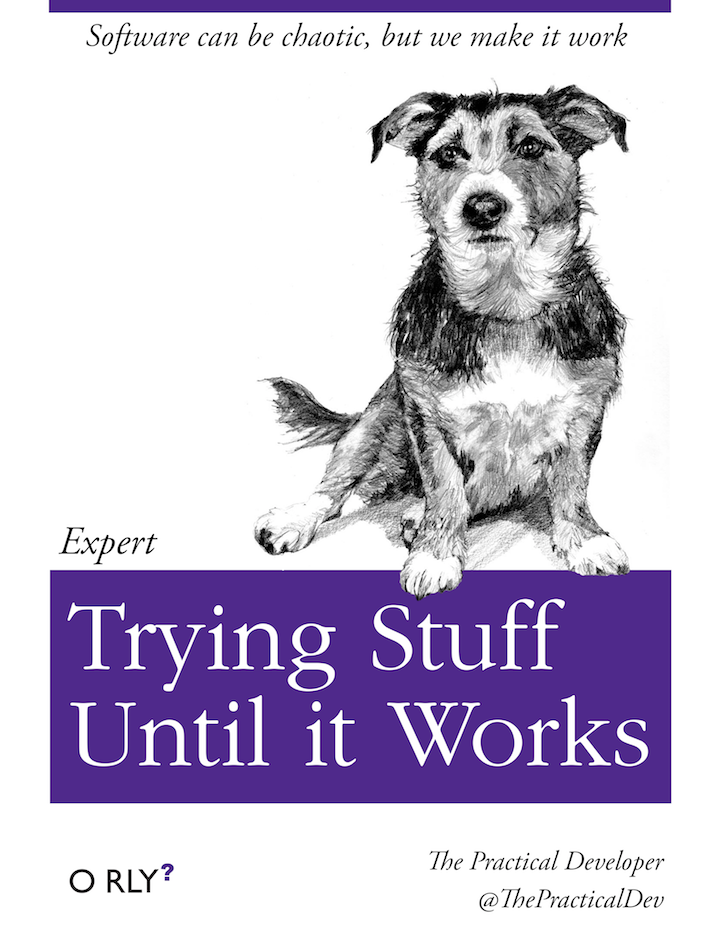
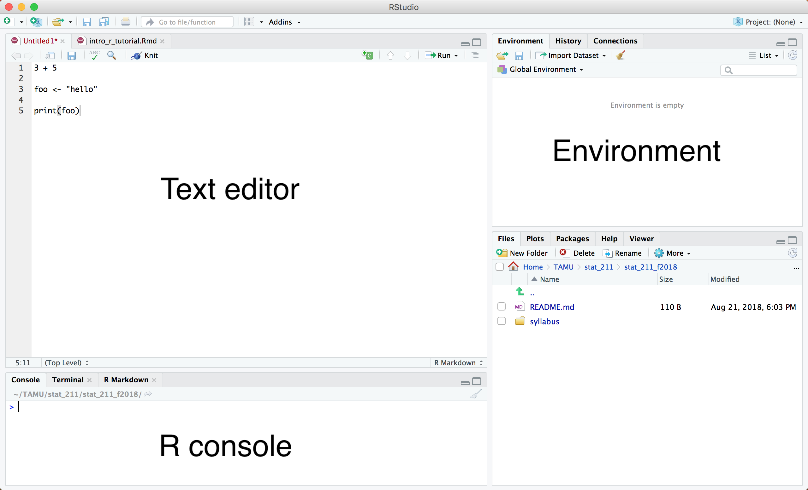

```{r setup, include=FALSE}
knitr::opts_chunk$set(echo = TRUE)
doc_type <- knitr::opts_knit$get("rmarkdown.pandoc.to")
set.seed(1)
```

# Administrative

1. Get webassign

2. Accept Piazza invite

3. Read syllabus 

4. Download R and Rstudio

`r if (doc_type == "html") {"---"}`

# What is Statistics?

> Statistics is the science of learning from data, and of measuring, controlling, and communicating uncertainty; and it thereby provides the navigation essential for controlling the course of scientific and societal advances.

-- Marie Davidian and Thomas A. Louis, *Why Statistics?*, Science 2012.


`r if (doc_type == "html") {"---"}`

# Why should you care

`r if (doc_type == "html") {".center["}`
```{r echo = FALSE, fig.height = 4}
roster <- read.csv("roster_509_f2018.csv")
roster_major <- sort(table(roster$MAJOR), decreasing = TRUE)
cex_val <- ifelse(doc_type == "html", 1, .8)
plot(roster_major, las = 2, ylab = "Students", 
     cex.lab = cex_val, cex.axis = cex_val, cex.main = cex_val, cex.sub = cex_val)
```
`r if (doc_type == "html") {"]"}`

`r if (doc_type == "html") {"---"}`

- Computer science/software engineering
    - A/B Testing
    - Recommendation
    
- Civil engineering
    - Traffic management
    - Risk and reliability
    
- Industrial engineering
    - Statistical process control
    - Queuing theory
    
- Mechanical engineering
    - Optimal control 
    
`r if (doc_type == "html") {"---"}`
    
- Biology
    - Genome-wide association study
    - Phylogeny
    
- Meteorology
    - Model output statistics
    - Ensemble forecasts
    
- Economics
    - Dynamic stochastic general equilibrium models
    - Factor investing
    
- Chemistry
    - Multivariate calibration

`r if (doc_type == "html") {"---"}`

- Humanities
    - Topic modeling
    - Distant reading

- Psychology
    - Personality testing
    - Standardized testing
    
- Politics
    - Polling
    - Ideal point models

- Marketing
    - Market basket analysis

`r if (doc_type == "html") {"---"}`

# Motivating example

In the 2015 season of the National Football League (NFL), the Houston Texans won 9 of their 16 games.

- Win percentage: (9 / 16) x 100% = 56.25%.

- Is "real" win percentage better than chance (50%)?

- What is the probability of 9 or more wins out of 16 if real win percentage is 50%?

`r if (doc_type == "html") {"---"}`

Simulate result of a season

```{r}
p <- 0.5
season <- sample(c(0, 1), size = 16, replace = TRUE, prob = c(1 - p, p))
win_total <- sum(season)
season
win_total
```

`r if (doc_type == "html") {"---"}`

Run simulation 1000 times

```{r}
n <- 1000
win_total <- replicate(n, {
  season <- sample(c(0, 1), size = 16, replace = TRUE, prob = c(1 - p, p))
  sum(season)
})
```

Frequencies of win totals:

```{r}
table(win_total)
```

`r if (doc_type == "html") {"---"}`

Win probabilities

```{r}
table(win_total) / n
sum(win_total >= 9) / n
```

`r if (doc_type == "html") {"---"}`

# Learning R

## Resources

- StackOverflow
- DataCamp introduction
- Rstudio cheatsheets

## General Advice

- Just trying something has no cost; guess and check
 
`r if (doc_type == "html") {
  "???\n Would this work?"
}`

`r if (doc_type == "html") {"---"}`

`r if (doc_type != "html") {"<!--"}`

```{r out.width = "400px", echo = FALSE, fig.align = "center"}

```

`r if (doc_type != "html") {"-->"}`

`r if (doc_type == "html") {"---"}`

# Using R

```{r echo = FALSE}

```

`r if (doc_type == "html") {"---"}`

# Suggested workflow

1. Open Rstudio

2. Change working directory: Ctrl + Shift + h

3. Create script: Ctrl + Shift + n

4. Write, save code in script

5. Run code
    1. source the script, or
    2. run line by line

`r if (doc_type == "html") {"---"}`

# R Syntax

```{r}
# this is a comment

# use R as a calculator
3 * (5 + sqrt(2) + pi)
```

```{r assignment}
# assignment
a <- TRUE
b = 2
```

```{r comparison}
# comparison
10 > 20
is.na(NA) & (5 > b)
```

`r if (doc_type == "html") {"---"}`

Control Flow

```{r control flow}
# conditional
if (!a) {
  print("hello")
} else {
  print("goodbye")
}

# for loop
for (i in 1:10) {
  cat(i)
}

# while loop
x <- 4
while (x > 0) {
  cat(x ^ 2)
  cat(" ")
  x <- x - 1
}
```

`r if (doc_type == "html") {"---"}`

Data Types

```{r vectors}
# vectors
vec1 <- c(1, 5, 4, 3)
vec2 <- 1:10
vec3 <- seq(from = -4, to = 2, by = 2)
```

```{r vector subsetting}
# get first element
vec1[1]

# change 2nd element value
vec1[2] <- 1000
vec1

# get length
length(vec3)
```

`r if (doc_type == "html") {"---"}`

```{r lists}
# lists
list1 <- list(1, "a", 3)
list1
```

```{r subsetting and selection}
# get first element, not a list
list1[[1]]

# get sublist, this is a list
list1[1]
```

`r if (doc_type == "html") {"---"}`

```{r data frame}
# data frames
names <- c("Bob", "Fatima", "Pierre")
df <- data.frame(age = c(10, 15, 23),
                 name = names)
df
```

```{r results = "hold"}
# get a column, 3 ways to do same thing
df[, "name"]
df$name
df[, 2]
```

```{r results = "hold"}
colnames(df)
dim(df)
```

`r if (doc_type == "html") {"---"}`

Reading/writing data sets

```{r write.csv}
# write df to csv, look at directory contents
write.csv(df, "demo_file.csv", row.names = FALSE)
dir()
```

```{r read.csv}
# read df back in
df2 <- read.csv("demo_file.csv")
df
df2
```

`r if (doc_type == "html") {"---"}`

Plotting

```{r plots, fig.align = "center"}
y_vals <- rnorm(100)
boxplot(y_vals)
```

`r if (doc_type == "html") {"---"}`

Functions

```{r functions}
# define function
hello_func <- function(name, response = "hello") {
  paste0(name, " says ", response)
}

# call function
hello_func("Patrick")

# see function
hello_func

# override default argument
hello_func("Patrick", response = "goodbye")
```

`r if (doc_type == "html") {"---"}`

Getting help

Use `?` or `help()`

```{r help commands}
?hist

help(read.csv)
```

`r if (doc_type == "html") {"---"}`

Packages

Stand on the shoulders of giants

```{r fig.height = 4, fig.width = 6, fig.align = "center"}
# download a package, lattice
# install.packages(lattice)

# call a function from a package
lattice::barchart(roster_major)
```

`r if (doc_type == "html") {"---"}`

```{r fig.height = 4, fig.width = 6, fig.align = "center"}
# load packages into environment, call function directly
library(lattice) 
dotplot(roster_major)
```
