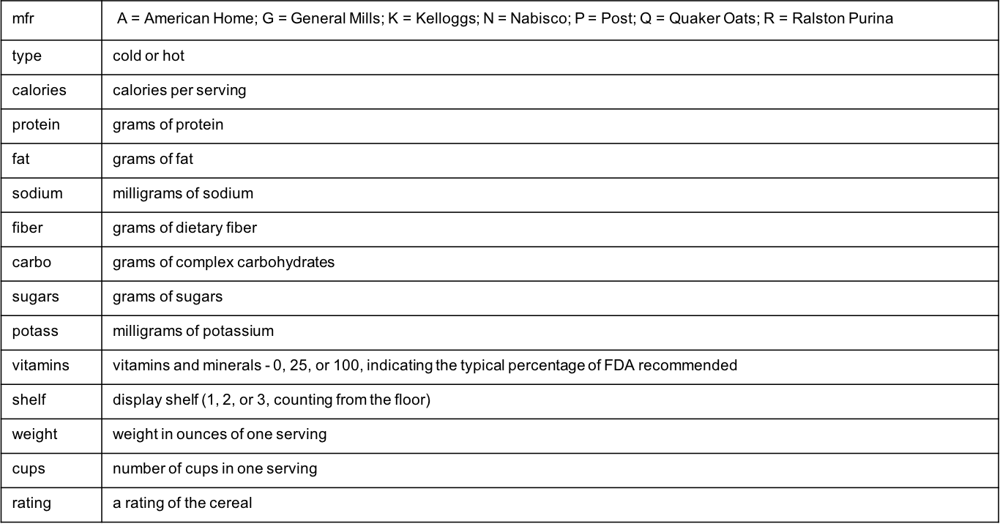

# Topic Overview

- Populations and samples
- Frequency distributions
- Histograms 
- Mean, median, variance and standard deviation
- Quartiles, interquartile range 
- Boxplots


# What is Statistics?

- Statistics: the science of collecting, classifying, and interpreting data.

- Anticipated learning outcomes:
    - appreciate and apply basic statistical methods in an everyday life setting
    - appreciate and apply basic statistical methods in their scientific field


# Where will Statistics be used?

- Everyday life
    - Proper application of general probabilities
    - How election results are presented
    - Commercial claims (clinical trials vs. outliers)
    
- Industry applications
    - Google web searches
    - Netflix user recommendations
    - Pharmaceutical drug development
    - Sports analytics
    - Modeling global climate change
    - Credit card fraud detection
    - Biomarkers and disease detection
    - Criminal justice


# Collecting data

- **Observational study**: Observe a group and measure quantities of interest.  This is passive data collection in that one does not attempt to influence the group.  The purpose of the study is to describe the group. 

- **Experiment**: Deliberately impose treatments on groups in order to observe responses.  The purpose is to study whether the treatments cause a change in the responses.


# Observational Study

## Definitions

1. **Population**: The entire group of interest

2. **Sample**: A part of the population selected to draw conclusions about the entire population

3. **Census**: A sample that attempts to include the entire population

4. **Parameter**: A concept that describes the population

5. **Statistic**: A number produced from a sample that estimates a population parameter 


# Experiment

1. **Experimental Group**: A collection of experimental units subjected to a difference in treatment, imposed by the experimenter.

2. **Control Group**: A collection of experimental units subjected to the same conditions as those in an experimental group except that no treatment is imposed.

This design helps control for potential confounding effects.


# Cereal Data




# Summarizing single categorical variable

- **Frequency** - number of times the value occurs in the data
- **Relative frequency** - proportion of the data with the value


# Summarizing single categorical variable


```
## mfr
##  G  K  N  P  Q  R 
## 22 21  3  9  5  5 
## mfr
##          G          K          N          P 
## 0.33846154 0.32307692 0.04615385 0.13846154 
##          Q          R 
## 0.07692308 0.07692308
```


\includegraphics{data_collection_summary_files/figure-latex/unnamed-chunk-1-1} 


# R script for histograms of state data


```r
summary(USArrests)
```

```
##      Murder          Assault     
##  Min.   : 0.800   Min.   : 45.0  
##  1st Qu.: 4.075   1st Qu.:109.0  
##  Median : 7.250   Median :159.0  
##  Mean   : 7.788   Mean   :170.8  
##  3rd Qu.:11.250   3rd Qu.:249.0  
##  Max.   :17.400   Max.   :337.0  
##     UrbanPop          Rape      
##  Min.   :32.00   Min.   : 7.30  
##  1st Qu.:54.50   1st Qu.:15.07  
##  Median :66.00   Median :20.10  
##  Mean   :65.54   Mean   :21.23  
##  3rd Qu.:77.75   3rd Qu.:26.18  
##  Max.   :91.00   Max.   :46.00
```

```r
par(mfrow = c(1, 2))
hist(USArrests$Murder, main = "Murder")
hist(USArrests$UrbanPop, main = "Urban Population")
```


\includegraphics{data_collection_summary_files/figure-latex/unnamed-chunk-2-1} 

# Summary statistics for quantitative data

## Measures of central tendency

- The **sample median** is the middle observation if the values are arranged in increasing order.  

- The **sample mean** of n observations is the average, the sum of the values divided by n:

\begin{align}
\bar{x} = \frac{1}{n}\sum_{i=1}^n x_i
\end{align}

