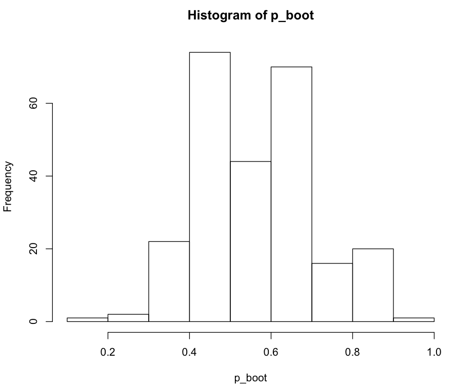
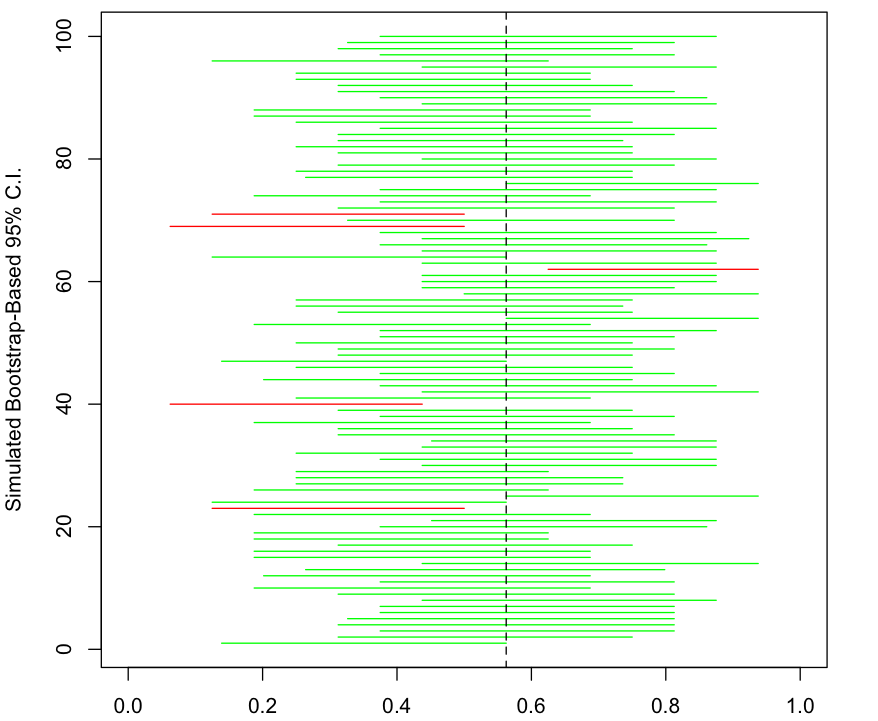
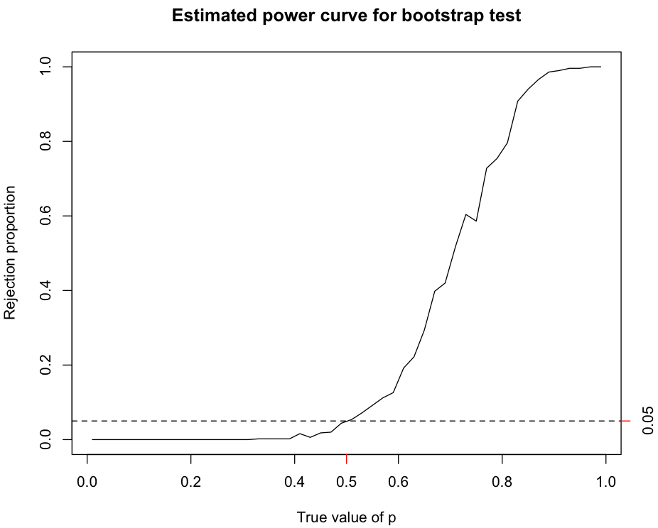

```{r setup, include=FALSE}
knitr::opts_chunk$set(echo = TRUE)
dt <- knitr::opts_knit$get("rmarkdown.pandoc.to")
set.seed(1)

source("../slide_tools.R")

library(ggplot2)
library(data.table)
library(cowplot)
```

#  Statistical Inference 

+ There is a population we wish to study. We take a sample of data, and we want
  to use it learn about the population.

+ We model the observed sample data as outcomes of random variables that represent
  the population. We want to know the parameters of these random variables, the 
  population parameters.
  
+ **Population**: the entire group of interest.

+ **Sample**: a part of the population selected to draw conclusions about the population.

`r ns(dt)`

## 3 problems in statistical inference:

+ **Point estimation** : single estimate of the parameter of interest
	
    + Maximum likelihood estimation
	
+ **Confidence** **interval** : a range of “plausible” values for the parameter of interest, at a stated level of “confidence”
	
+ **Hypothesis test** : a formal decision about the value of the parameter of interest, again at a stated level of “confidence”

`r ns(dt)`

## Sampling Distribution

+ We get model the data, $X_1, \ldots, X_n$, as independently following some distribution.
  	
+ Compute a sample **statistic** to estimate the parameter of interest.
	
    + Mean: $\hat{\mu} = \frac{1}{n}\sum_{i=1}^n X_i$
    + Standard deviation: $\hat{\sigma} = \sqrt{\frac{1}{n-1}\sum_{i=1}^n (X_i - \hat{\mu})^2}$
	    
+ In general, a statistic is a function $g(X_1, \ldots, X_n)$. This is a function 
	  of random variables, so it too is a random variable.
	
	+ So the statistic has a distribution, called its **sampling distribution**

`r ns(dt)`
	
## Three distributions

```{r echo=FALSE, fig.height = 5, message=FALSE, warning=FALSE}
pop_plot <- qplot(x = 0:50, xend = 0:50, y = dpois(0:50, lambda = 20), yend = 0,
                  geom = "segment", main = "Population distribution", 
                  ylab = "P(N = n)", xlab = "n") + theme_classic()

samples <- melt(data.table(replicate(8, rpois(50, 20))))
sample_plot <- ggplot(samples, aes(x = value)) + 
  geom_histogram() +
  facet_wrap(facet = "variable", nrow = 2) +
  theme_classic() +
  theme(axis.text.x = element_text(angle = 45, hjust = 1),
        strip.text.x = element_blank(), strip.background = element_blank()) +
  labs(title = "Sample distribution", xlab = "n")

sample_means <- samples[,mean(value), variable]
sampling_plot <- qplot(x = sample_means$V1, main = "Sampling distribution", 
                       xlab = "sample mean") + theme_classic()
plot_grid(pop_plot, sample_plot, ncol = 1)
```

`r ns(dt)`

```{r echo=FALSE, fig.height=2, message=FALSE, warning=FALSE}
sampling_plot
```
	
`r ns(dt)`

## Using the sampling distribution
	
+ Confidence interval : use the sampling distribution to obtain an interval of statistic values with a specified probability, e.g. 0.95, of being observed.
	
+ Hypothesis test : use the sampling distribution that would apply for a particular hypothesized parameter value to compute the probability of seeing data like those you saw; reject the hypothesized value if this probability, called a **p-value** , is sufficiently small, e.g. less than 0.05.

`r ns(dt)`

##  Computing / Approximating Sampling Distributions 

+ If we fully specify a probability model, we can often derive a sampling distribution exactly.

+ Other times, we can approximate it using asymptotic (limiting) results, which requires that we have a “large” sample size *n* .

+ Alternatively, if we can somehow *draw random samples from the sampling distribution*, we can use them to approximate the sampling distribution.

+ Recall how we have used R, e.g. via the ‘ rbinom ’ function, to simulate from a distribution, enabling us to approximate probabilities as simple proportions.

`r ns(dt)`

#  The Bootstrap 

+ The **bootstrap** involves sampling with replacement from the observed data:

Repeat B times:

 data_b = sample with replacement from data

 statistic_b = value of statistic for ‘ data_b ’
 
+ Now you have B simulated values of the statistic, and you can use them to approximate the sampling distribution, enabling both confidence intervals and hypothesis tests.

`r ns(dt)`

#  Example: NFL 



`r ns(dt)`

# Confidence Intervals

+ A procedure for generating intervals such that if you repeated your experiment 
  and constructed intervals many times, about $100(1-\alpha)\%$ of them will cover 
  the unknown parameter value.
  
+ Any one confidence interval either contains the parameter with probability 1 or
  otherwise it doesn't, contains with probability 0.
  
+ $\alpha$ is the confidence level. 

`r ns(dt)`

##  Confidence Intervals with the Bootstrap 

+ One way to construct an approximate $100(1-\alpha)\%$ confidence interval for a 
  parameter (e.g., $p$ in the Binomial case) is to:
	
	+ Use the bootstrap to approximate the sampling distribution of $\hat{p}$.
	
	+ Obtain the $\alpha/2$ and $1-\alpha/2$ percentiles of the bootstrapped sampling distribution.
	
	+ For example, the interval from the 2.5th percentile to the 97.5th percentile of the bootstrapped      sampling distribution of is an approximate 95% confidence interval for $p$.

`r ns(dt)`

##  Interpretation of Confidence Intervals 

+ We expect of $100(1-\alpha)\%$ of all such confidence intervals to contain the parameter being  
  estimated.
	
+ That means we expect $\alpha\%$ of such intervals to *not* contain the parameter being estimated.
	
+ Once we observe data and use it to compute an actual confidence interval:
		
    + We can say we obtained our interval by using a technique that can be expected to ‘cover’ the true parameter value with probability .
		
    + We cannot say whether our particular interval covers the true parameter value or not.

`r ns(dt)`

#  Example: NFL 

+ See “ nfl.r ” and ‘ch_5_1’ lecture video.

`r ns(dt)`



`r ns(dt)`

#  Hypothesis Tests 

+ The **null hypothesis** ($H_o$) is what we choose to believe until shown sufficient evidence to 
	the contrary.
	
+ The **alternative hypothesis** ($H_a$) is what we will conclude if the null hypothesis is     
	 rejected.

+ A **p-value** is the probability of seeing a statistic value like ours, or even more ‘extreme’, if    *the null hypothesis is true*.

+ To compute a p-value, we require the sampling distribution of our statistic 
  when *the null hypothesis is true*.

+ Potential errors:
	+ Type I: Reject $H_o$ when it is true.
	+ Type II: Fail to reject $H_o$ when it is false.

`r ns(dt)`

##  Hypothesis Tests with the Bootstrap 

+ One way to compute a p-value based on a statistic $T$, for which we observe the
  value $T_o$ with our data:
	
	+ Transform the data to force the null hypothesis to be true.
	
	+ Use the bootstrap on the transformed data to approximate the sampling 
	  distribution of $T$ under the null hypothesis.
	
	+ Compute the proportion of simulated values of $T$ that are ‘as or more extreme’ 
	  relative to $T_o$.
	
	+ For example, in the Binomial case, ‘as or more extreme’ is as follows:
		+ $H_o:\; p = p_o$ vs. $H_a:\; p > p_o$: ‘as or more extreme’ means $\ge T_o$.
		+ $H_o:\; p = p_o$ vs. $H_a:\; p < p_o$: ‘as or more extreme’ means $\le T_o$.
		+ $H_o:\; p = p_o$ vs. $H_a:\; p \ne p_o$: : ‘as or more extreme’ means $\ge |T_o|$ in absolute   
		  value

`r ns(dt)`

##  Interpretation of Hypothesis Tests 

+ Based on our p-value and desired confidence level , we make a decision as follows:
	+ If p-value $\le \alpha$, reject $H_o$ in favor of $H_a$.
	+ Otherwise, “fail to reject” $H_o$.

+ If $H_o$ is true but we observe p-value $\le \alpha$, we reject $H_o$, 
  committing a **Type I error**. 

+ If $H_a$ is true but we observe p-value $>\alpha$, we fail to 
  reject $H_o$, committing a **Type II error**.

+ If $H_o$ is true, we expect to commit a Type I error no more than $\alpha\%$ of the time.

+ Once we observe data and use it to compute an actual p-value, making a decision based on whether it is :
    + We can say we made our decision based on a technique that can be expected to commit a Type I 
		  error no more than of $\alpha\%$ of the time.
    + We cannot say whether we have committed a Type I error in this instance.

`r ns(dt)`


