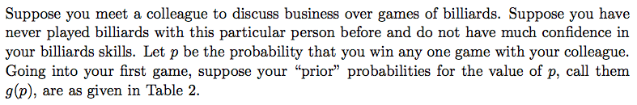
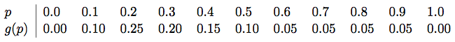

```{r setup, include=FALSE}
knitr::opts_chunk$set(echo = TRUE)
dt <- knitr::opts_knit$get("rmarkdown.pandoc.to")
set.seed(1)

source("../slide_tools.R")
library(ggplot2)
```

#  Bayes Theorem 

Let $X$ and $Y$ be two discrete random variables:

+ marginal pmfs $f_X$ and $f_Y$ (probabilities of individual values):

	+ $P(X = x) = f_X(x)$
	
	+ $P(Y = y) = f_Y(y)$

+ conditional pmf of $Y$, given the value of $X$
  
  + $P(Y = y | X = x) = f_{Y|X}(y|x)$

**Bayes Theorem:**

$$P(X = x | Y = y) = \frac{P(Y = y | X = x) P(X = x)}{\sum_x P(Y = y | X = x)P(X = x)}$$

`r ns(dt)`

#  Posterior Distributions 

Suppose we want to estimate the unknown parameter of some distribution $f$. We 
obtain a random (IID) sample of observations ( *data* ) from $f$, resulting in a likelihood of:

$$ L(\theta) = f(data|\theta)$$

Suppose we are willing to treat the parameter $\theta$, a fixed quantity in the
population, nevertheless as if it were a random variable, with **prior** 
distribution $g$. Then an alternative strategy for inference could be based on an application of Bayes Theorem:

$$
\begin{aligned}
\text{posterior} &= h(\theta|data) 
\\
&= \frac{f(data|\theta)g(\theta)}{\sum_\theta f(data|\theta)g(\theta)}
\\
&= \frac{\text{likelihood} \times \text{prior}}{\sum \text{likelihood} \times \text{prior}}
\end{aligned}
$$

`r ns(dt)`

## Illustration

We have prior beliefs about the vote share $p$ a candidate will recieve in an 
election:

```{r fig.height=3.5, echo=FALSE}
x <- seq(0, 1, .01)
a0 <- b0 <- 10
plot(x, dbeta(x, a0, b0), type = "l", lty = 2, xlab = "p", ylab = "")
```

`r ns(dt)`

We poll one voter in their district to get a sense of voter intention, and update
our beliefs:

```{r fig.height=3.5, echo=FALSE}
poll <- 0
post_a <- a0 + poll
post_b <- b0 + 1 - poll
plot(x, dbeta(x, a0, b0), type = "l", lty = 2,
     xlab = "p", ylab = "")
lines(x, dbeta(x, post_a, post_b))
legend("topright", legend = c("prior", "posterior"), 
       lty = c(2, 1))
```

`r ns(dt)`

We poll many voters and use the combined information to update our beliefs:

```{r fig.height=3.5, echo=FALSE}
N <- 100
polls <- rbinom(N, size = 1, prob = .3)
post_a <- a0 + sum(polls)
post_b <- b0 + N - sum(polls)
plot(x, dbeta(x, a0, b0), type = "l", lty = 2, ylim = c(0, 10), 
     xlab = "p", ylab = "")
lines(x, dbeta(x, post_a, post_b))
legend("topright", legend = c("prior", "posterior"), 
       lty = c(2, 1))
```


`r ns(dt)`

## Example: Billiards 

+ See billiards.R:

+ Prior to playing any games, how confident are you that you are the better player in this matchup?

+ After winning the first 3 games in a row, now how confident are you?

+ After then losing the next 2 games (for a total record of 3 wins and 2 losses), now how confident are you?

.pull-left[]

.pull-right[]

`r ns(dt)`

#  Frequentist vs. Bayesian Inference 

+ Frequentist:

	+ Probability refers to limiting relative frequencies.
	
	+ Parameters are fixed, unknown constants.
	
	+ Statistical procedures designed to have long-run frequency properties.
	
+ Bayesian:

	+ Probability described degree of belief, not limiting frequency.
	
	+ We can make probability statements about parameters.
	
	+ We make inferences about a parameter by producing a probability distribution for it.

`r ns(dt)`

#  Conjugate Priors 

+ When prior and posterior are in same family, the prior is said to be *conjugate* with respect to the model.

+ With conjugate priors, can easily draw samples directly from posterior.

+ Example:

	+ Binomial likelihood and beta prior: posterior also binomial
	
	+ Normal likelihood and normal prior: posterior also normal
	

`r ns(dt)`

#  Functions of Parameters 

+ How to make inference about a function $\tau = g(\theta)$

- Recall how we solved the problem when the density of $X$ was given as $f_X$ 
  and we found out density for $Y = g$. We will apply the same reasoning here.

+ The posterior CDF for $\tau$ is
  
  $$H(\tau | x^n) = P(g(\theta) \le \tau ) = \int_A f(\theta | x^n) d\theta$$
  Where $A = \{\theta: g(\theta) \le \tau\}$
  
+ The posterior density is

  $$h(\tau | x^n) = H'(\tau|x^n)$$

`r ns(dt)`

#  Simulation 

+ The posterior can be approximated by simulation

+ If we draw $\theta_1 , \dots, \theta_B \sim p(\theta | x^n)$, then a histogram
  of $\theta_1, \ldots, \theta_B$ approximates the density $p(\theta|x^n)$
  
+ Mean $\bar{\theta}_n= E(\theta | x^n)$ is 
  $$\frac{1}{B} \sum_{j=1}^B \theta_j$$
  
+ Let $\tau_i = g(\theta_i)$, then $\tau_1, \ldots, \tau_B$ is a sample from 
  $f(\tau|x^n)$

+ This avoids the need for any analytical calculation.

`r ns(dt)`

# Credible intervals

+ Once we have $p(\theta|X)$ we can create intervals into which $\theta$ falls with
  a certain probability--a **credible interval**.

+ Unlike a confidence interval, for a $1-\alpha$ credible interval we can say that 
  with probability $1-\alpha$ $\theta$ falls in the interval. 

+ The posterior $1-\alpha$ interval can be approximated by 
  $(\theta_{\alpha/2}, \theta_{1-\alpha/2})$ where $\theta_{\alpha/2}$ is the 
  $\alpha/2$ sample quantile of $\theta_1, \ldots, \theta_B$

`r ns(dt)`

#  Flat Priors 

+ In case of a more complicated problem where there are many parameters, finding prior $f(\theta)$ seems impractical.

+ An alternative is to define some sort of “noninformative prior”.

+ Flat prior $f(\theta) \propto constant$ can be used as a noninformative prior.

+ Flat priors are not invariant.

+ Unfettered use of flat priors raises some questions

`r ns(dt)`

#  Improper Priors	 

+ If Flat prior $f(\theta) \propto c$ where $c > 0$ is a constant, then
  $\int f(\theta)d\theta = \infty$

+ In usual sense this is not a real probability density. Such priors are called **Improper** **Prior**

+ The Jeffrey’s rule for creating a (invariant) prior:
  $f(\theta) \propto I(\theta)^{1/2}$, where $I(\theta)$ is the Fisher 
  information 

+ Improper priors are not a problem as long as the resulting posterior is a well 
  defined probability distribution
