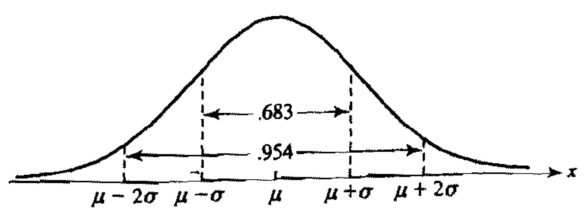

```{r setup, include=FALSE}
knitr::opts_chunk$set(echo = TRUE)
dt <- knitr::opts_knit$get("rmarkdown.pandoc.to")
set.seed(1)

source("../slide_tools.R")
library(latex2exp)
library(mvnfast)
library(ggplot2)
```


#  Continuous Random Variables 

Let $X$ be a continuous random variable:

+ The **probability density function (pdf)** $f$ is defined as

$$P(a < X \le b) = \int_a^b f(x) dx, \quad a \le b$$

+ The **cumulative distribution function (cdf)** $F$ is defined as

$$F(x) = P(X \le x) = \int_{-\infty}^x f(x)dx$$

+ At every point $x$ at which $f(x)$ is continuous,

$$F'(x) = f(x)$$

`r ns(dt)`

```{r echo=FALSE, fig.margin=TRUE}
x <- seq(0, 20, .01)
y <- dchisq(x, df = 5)

if (dt == "html") par(mfrow = c(1, 2))

plot(x, y, ylab = "f(x)", xlab = "x", type = 'l', 
     main = "PDF of chi-square with df = 5")
text(x = 13, y = 0.14, labels = TeX('$P(5 < x \\leq 10) = 0.341$'))
polygon(x = c(5, 5:10, 10, 5), y = c(0, dchisq(c(5:10), df = 5), 0, 0), col = "red")

plot(x, pchisq(x, df = 5), ylab = "F(x)", xlab = "x", type = "l",
     main = "CDF of chi-square with df = 5")
points(5, pchisq(5, df = 5), pch = 19, col = "red")
points(10, pchisq(10, df = 5), pch = 19, col = "red")
segments(x0 = 10, y0 = pchisq(10, df = 5), x1 = 10, y1 = pchisq(5, df = 5), col = "red")
abline(h = pchisq(c(5, 10), df = 5), lty = 3)
text(12, .5, TeX("$F(10) - F(5) = 0.341$"))
```

`r ns(dt)`

+ Beta
    + $f(x; \alpha, \beta) = \frac{\Gamma(\alpha + \beta)}{\Gamma(\alpha)\Gamma(\beta)}x^{\alpha - 1}(1 - x)^{\beta - 1}, \quad x \in [0, 1]$
    + conjugate prior for binomial distribution parameter $p$
    + In R: (d|p|q|r)beta
    
    ```{r echo=FALSE, fig.height = 2.5, fig.width = 4}
    x <- seq(0, 1, .01)
    plot(x, dbeta(x, 1, 1), type = 'l', ylim = c(0, 3), ylab = "", xlab = "",
         cex.main = .75, cex.lab = .75, cex.axis = .75)
    lines(x, dbeta(x, .1, .1), lty = 2)
    lines(x, dbeta(x, 6, 2), lty = 3)
    lines(x, dbeta(x, 3, 5), lty = 4)
    ```

`r ns(dt)`

+ Chi-square $\chi^2$
    + $f(x; df),\quad x \in [0, \infty)$
    + Chi-square test for goodness of fit
    + In R: (d|p|q|r)chisq
    
    ```{r echo=FALSE, fig.height = 2.5, fig.width = 4}
    x <- seq(0, 10, .01)
    plot(x, dchisq(x, df = 2), type = 'l', ylab = "", xlab = "",
         cex.main = .75, cex.lab = .75, cex.axis = .75)
    lines(x, dchisq(x, df = 3), lty = 2)
    lines(x, dchisq(x, df = 6), lty = 3)
    ```

`r ns(dt)`

+ t
    + $f(x; df), \quad x \in (-\infty, \infty)$
    + t-test for difference in means
    + In R: (d|p|q|r)t
    
    ```{r echo=FALSE, fig.height = 2.5, fig.width = 4}
    x <- seq(-10, 10, .01)
    plot(x, dt(x, 1), type = 'l', ylab = "", xlab = "", ylim = c(0, .4),
         cex.main = .75, cex.lab = .75, cex.axis = .75)
    lines(x, dt(x, 3), lty = 2)
    lines(x, dt(x, 5), lty = 3)
    ```
    
`r ns(dt)`
    
+ F
    + $f(x; df1, df2), \quad x \in [0, \infty)$
    + F-test for equality of means in ANOVA
    + In R: (d|p|q|r)f
    
    ```{r echo=FALSE, fig.height = 2.5, fig.width = 4}
    x <- seq(0, 4, .01)
    plot(x, df(x, 1, 1), type = 'l', ylab = "", xlab = "", ylim = c(0, 1),
         cex.main = .75, cex.lab = .75, cex.axis = .75)
    lines(x, df(x, 5, 1), lty = 2)
    lines(x, df(x, 1, 5), lty = 3)
    lines(x, df(x, 5, 5), lty = 4)
    ```

`r ns(dt)`

## Continuous distributions in R

Suppose $X \sim \chi^2_2$. 

$P(1 \le X \le 3)$:

```{r}
pchisq(3, 2) - pchisq(1, 2)
```

$f(3)$:

```{r}
dchisq(3, 2)
```

Sample 10 numbers from $X$:

```{r}
rchisq(10, 2)
```


`r ns(dt)`

# Expected Values With Continuous RVs 

Let $X$ be a continuous random variable:

+ The expected value (*mean*) of $X$ is

$$E[X] = \mu = \int_{-\infty}^\infty xf(x)dx$$

+ The expected value of $g(X)$ is

$$E[g(X)] = \int_{-\infty}^\infty g(x)f(x)dx$$

+ The variance of $X$ is

$$Var(X) = \sigma^2 = E[(X - \mu)^2] = E[X^2] - (E[X])^2$$

+ The moment generating function of is

$$M(t) = E[e^{tX}] = \int_{-\infty}^{\infty} e^{tx}f(x)dx$$

`r ns(dt)`

# Joint and Conditional Distributions 

Let $X$ and $Y$ be continuous random variables with marginal pdfs $f_X$ and $f_Y$
and **joint probability density function** $f_{X,Y}$:

+ Joint probabilities are double integrals of the joint pdf:

$$P((X, Y) \in A) = \int\int_A f_{X,Y}(x, y)dxdy$$

+ The **conditional probability density function** $f_{Y|X=x}(y|x)$ of $Y$ given 
  that $X = x$ is:

$$f_{Y|X=x}(y|x) = \frac{f_{X,Y}(x,y)}{f_X(x)}$$

+ $X$ and $Y$ are **independent** if

$$f_{X,Y}(x,y) = f_X(x)f_Y(y)$$

`r ns(dt)`

# The Normal Distribution 

The random variable $X$ has a Normal distribution with parameters $\mu$ and $\sigma^2$
(written $X \sim N(\mu, \sigma^2)$) if its pdf is

$$ f(x) = \frac{1}{\sqrt{2\pi\sigma^2}} e^{-\frac{1}{2\sigma^2}(x-\mu)^2} $$

+ $E[X] = \mu$, $Var(X) = \sigma^2$

+ Let $Z = \frac{X - \mu}{\sigma}$. Then $Z \sim N(0, 1)$.

+ The 68 / 95 / 99.7 rule:
    + $P(-1 < Z < 1) \approx 0.68$
    + $P(-2 < Z < 2) \approx 0.95$
    + $P(-3 < Z < 3) \approx 0.997$

`r ns(dt)`



`r fb(dt)`

`r ns(dt)`

## Bivariate normal

If $X,Y$ are bivariate normal, then:

$$f_{X,Y}(x,y) = \frac{1}{2\pi\sigma_X\sigma_Y\sqrt{1 - \rho^2}}
  \exp\bigg(-\frac{1}{2(1-\rho^2)}\bigg[\frac{(x - \mu_X)^2}{\sigma_X^2} + 
            \frac{(y - \mu_Y)^2}{\sigma_Y^2} - 
            \frac{2\rho(x-\mu_X)(y-\mu_Y)}{\sigma_X\sigma_Y}\bigg]\bigg)$$

where $\mu_X$, $\mu_Y$ are the means of $X$ and $Y$, $\sigma^2_Y$, $\sigma^2_X$ 
are the variances, and $\rho$ is the correlation between $X$ and $Y$.

```{r echo=FALSE, fig.height = 4}
X = as.matrix(expand.grid(seq(-3,3,0.1), seq(-3,3,0.1)))
mean = c(0,0)
Sigma = matrix(c(1, .5, .5, 1), 2)

bn_pdf <- matrix(dmvn(X, mean, Sigma), ncol = 61)
persp(bn_pdf, theta = 30, phi = 30, col="white", d = 1.2,
      xlab = "x1", ylab = "x2", zlab = "f(x1,x2)")
```

`r fb(dt)`

`r ns(dt)`

# Sums of Independent Normal RVs 

Let $X_1, X_2, \ldots, X_n$ be iid Normal random variables with $X_i \sim N(\mu_i, \sigma_i^2)$,
$i=1,2,\ldots,n$. Let $a_1, a_2, \ldots, a_n$ be arbitrary constants. Then 

$$\sum a_iX_i \sim N\bigg(\sum a_i\mu_i, \sum a_i^2\sigma_i^2\bigg)$$ 

Special case: let $X_1, X_2, \ldots, X_n \sim iid \;  N(\mu, \sigma^2)$. Then sample mean

$$\bar{X} = \frac{1}{n}\sum_{i=1}^n X_i \sim N(\mu, \sigma^2/n)$$

`r ns(dt)`

#  Central Limit Theorem 

Let $X_1, X_2, \ldots, X_n$ be an IID sample from a distribution with mean $\mu$
and variance $\sigma^2$. This is not necessarily a Normal distribution. Assume 
that $\mu < \infty$ and $\sigma^2 < \infty$. 

+ As $n \rightarrow \infty$, the (sampling) distribution of $\bar{X}$ converges 
  to the Normal distribution with mean $\mu$ and variance $\sigma^2/n$, regardless
  of the distribution from which the sample was drawn.
  
+ If we have a “large enough” sample size, we can use a Normal distribution to 
  approximate the sampling distribution of $\bar{X}$, regardless of the form of 
  the population distribution.
  
	+ This facilitates mean-based statistical inference.
	
	+ Common rule of thumb for “large enough” is 30, although the required sample 
	  size varies depending on the situation.
