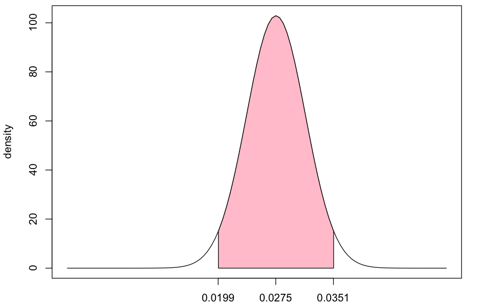
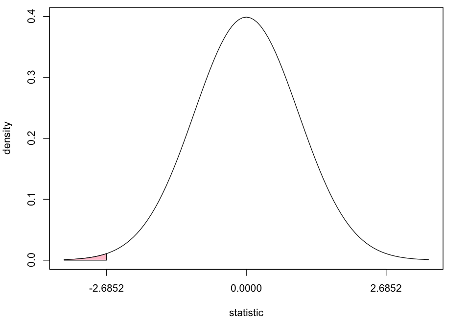
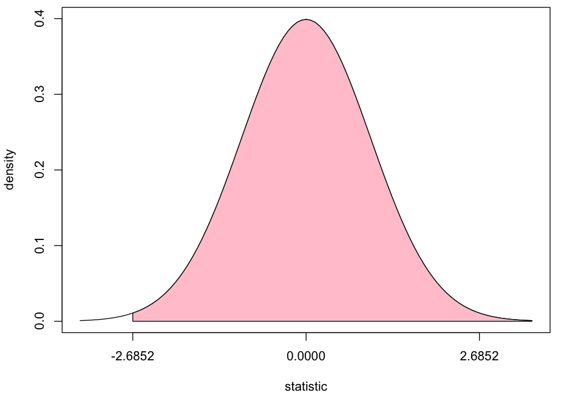
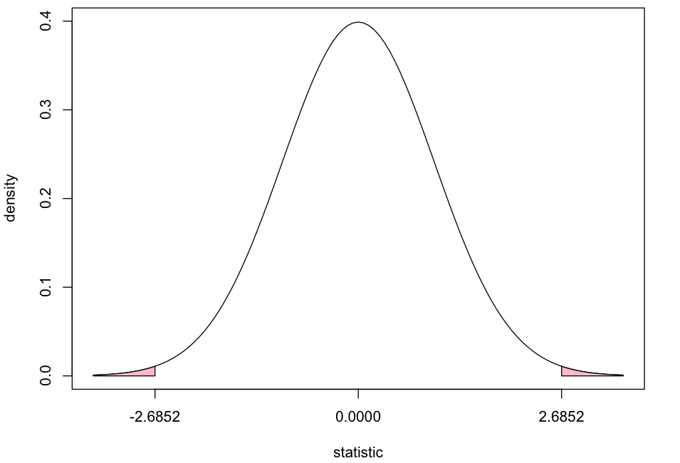
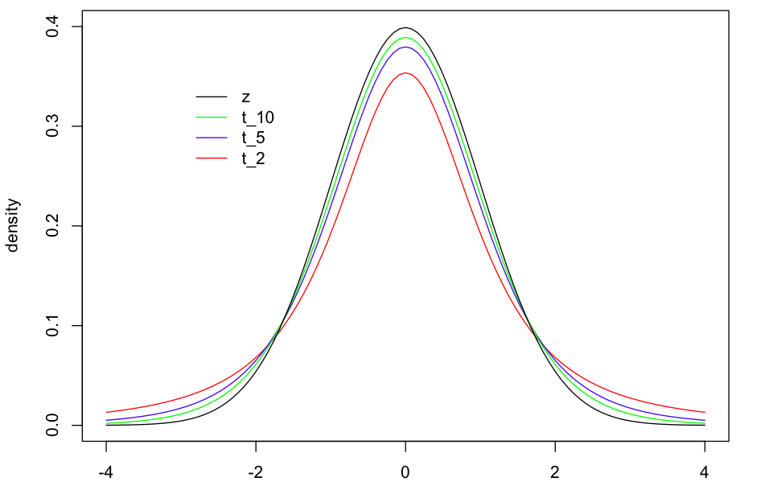

---
#  Maximum Likelihood Review 

Suppose we observe .
+ The likelihood is
+ The maximum likelihood estimator is

---
#  Example 

Suppose is Normal distribution with parameters :
+ Assume for now that the standard deviation is known (so, ). The likelihood is

with log likelihood

---
#  Example continued 

+ Differentiate with respect to :
+ Set equal to and solve for the MLE :

---
#  A Few (of many) Large-Sample Properties of MLEs 

+ **Consistency** : With a sufficiently large sample size , it is possible to determine the value of with arbitrary precision.
+ **Asymptotic Normality** : The distribution of is approximately Normal with mean and standard deviation obtained from the *Fisher information* matrix:
+ **Efficiency** : The MLE achieves the lowest possible asymptotic *mean squared error* (MSE) of all consistent estimators, called the *Cram* *r-Rao lower bound* .
+ **Functional Invariance** : The MLE of **** is .

---
#  Large sample inference on one proportion 𝒑 

#    

Suppose we observe “successes” out of independent Bernoulli trials, each with probability of success.
+ The MLE of is (reference chapter 2 notes):
+ With large , the approximate distribution of is

---
#  Large sample inference on one proportion 𝒑 (continued) 

#    

+ Approximate confidence interval for given by and percentiles of the

distribution.
+ Equivalently,

 where is the percentile of the .

---
#  Large sample inference on one proportion 𝒑 (continued) 

#    

+ Approximate confidence interval for given by and percentiles of the

distribution.
+ Equivalently,

 where is the percentile of the .
+ “estimate” “cutoff” “ sd of estimate”

---
#  Example: Hall of Fame – 95% CI for proportion 𝒑 in HOF 

#    

+ inner
+ 95%
+ lower bound
+ upper bound

---
#  Large sample inference on one proportion 𝒑 (continued) 

#    

+ To test , we require sampling distribution of  when :
+ Computing a p-value:
	+ (one-sided): pnorm ( *Z* )
	+ (one-sided): 1-pnorm( *Z* )
	+ (two-sided):
+ Reject if p-value .

---
#  Large sample inference on one proportion 𝒑 (continued) 

#    

+ To test , we require sampling distribution of  when :
+ Computing a p-value:
	+ (one-sided): pnorm ( *Z* )
	+ (one-sided): 1-pnorm( *Z* )
	+ (two-sided):
+ Reject if p-value .

---
#  Example: Hall of Fame – Test 𝑯𝟎:𝒑=𝟎.𝟎𝟒 vs. 𝑯𝒂:𝒑<𝟎.𝟎𝟒 

#    

+ p-value = 0.0036

---
#  Example: Hall of Fame – Test 𝑯𝟎:𝒑=𝟎.𝟎𝟒 vs. 𝑯𝒂:𝒑>𝟎.𝟎𝟒 

#    

+ p-value = 0.9964

---
#  Example: Hall of Fame – Test 𝑯𝟎:𝒑=𝟎.𝟎𝟒 vs. 𝑯𝒂:𝒑≠𝟎.𝟎𝟒 

#    

+ p-value = 0.0072

---
#  Similar large-sample MLE-based inference cases 

+ Inference on one mean :
	+ estimate , sd of estimate
+ Inference on a difference in two proportions :
	+ estimate = , sd of estimate =
+ Inference on a difference in two means :
	+ estimate = , sd of estimate =

---

---
#  Small-sample inference on proportion(s) 

+ Suppose we observe :
	+ Can compute confidence interval and compute exact p-value directly from the Binomial distribution.
		+ For example, to test vs. , can compute p-value as right-tail probability of Binomial distribution with evaluated at observed count .
		+ Reference binom.test () in R. Example in ‘yelp’ script.
+ Suppose and :
	+ Can either bootstrap or use *Fisher’s exact test* .
		+ Reference fisher.test () in R.

---

---
#  Small-sample inference on a mean 

Suppose we observe :
+ ,
+ Confidence interval:
+ To test :
	+ statistic =
	+ p-value from

---
#  Two-sample t-based inference 

Suppose we observe two IID samples from and from :
+ Assuming :
+ Otherwise:
+ estimated by software

---
#  Two-sample t-based inference 

Suppose we observe two IID samples from and from :
+ Assuming :
+ Otherwise:
+ estimated by software
+ See example in ‘yelp’ script.

---
#  Equivalence of confidence intervals and hypothesis tests 

Consider doing inference on parameter with “95% confidence”:
+ Equivalent ways to test vs. :
	+ r eject if p-value < 0.05 reject if not inside 95% CI
+ If one-sided , equivalence between p-value and *one-sided* CI (an upper bound).
	+ Example: stat_class.r
+ If one-sided , equivalence between p-value and one-sided CI (a lower bound this time).
